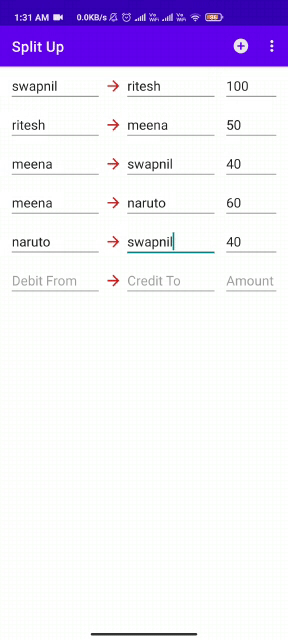
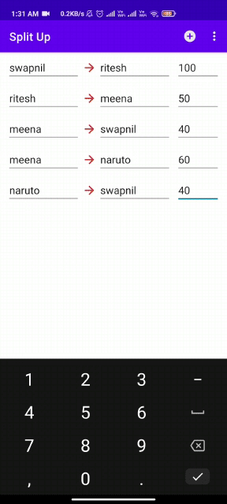
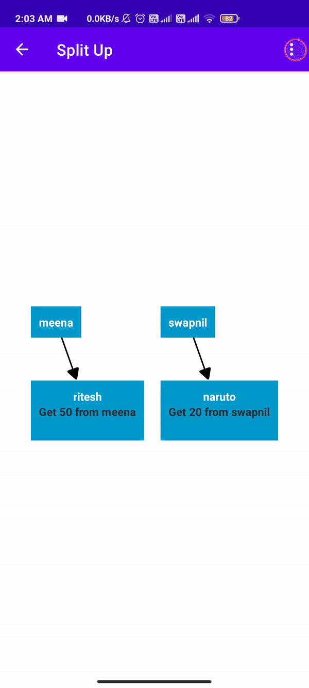

## Split-Up
This mini project minimizes the number of transaction required to complete a settlement betweent peoples     
To minimize the transactions am using Graph data structure.   
[Algoritm](https://github.com/DonutsDevil/Split-Up/blob/main/Source%20Code/java/Utils/SplitUtils.java) This class is responsible for minimizing the amount of transaction required 

## MainPage 
 

This is the place where we add the information about who is the Debtor(Giver), Who is creditor(Recevier) money and the amount of money to transfer, It also includes data validation.      
Code For [Swipe To Delete Feature](https://github.com/DonutsDevil/Split-Up/blob/main/Source%20Code/java/Utils/SwipeToDeleteCallback.java),
[Main Activity](https://github.com/DonutsDevil/Split-Up/blob/main/Source%20Code/java/MainActivity.java) and  [Adapter](https://github.com/DonutsDevil/Split-Up/blob/main/Source%20Code/java/adapter/AddTransactionAdapter.java).

## Graph View
 

Here We can see the minimize version of the transaction history, This tells us the best minimize transaction possible to settle the paymemnts of easy and every person.    
Code for [GraphResult](https://github.com/DonutsDevil/Split-Up/blob/main/Source%20Code/java/ResultActivity.java) Here [Utils](https://github.com/DonutsDevil/Split-Up/tree/main/Source%20Code/java/Utils) and Adapters are used to

## ListType List

Here the result is same as it was in te graph view, Just the diffeence is i am using Recycler view to show the Minimum Transaction.
Code [DisplayListType](https://github.com/DonutsDevil/Split-Up/blob/main/Source%20Code/java/DisplayListActivity.java)

### NOTE : This wont transfer any money between people.

Using [Zoom libary](https://github.com/natario1/ZoomLayout) to zoom in and out. 
